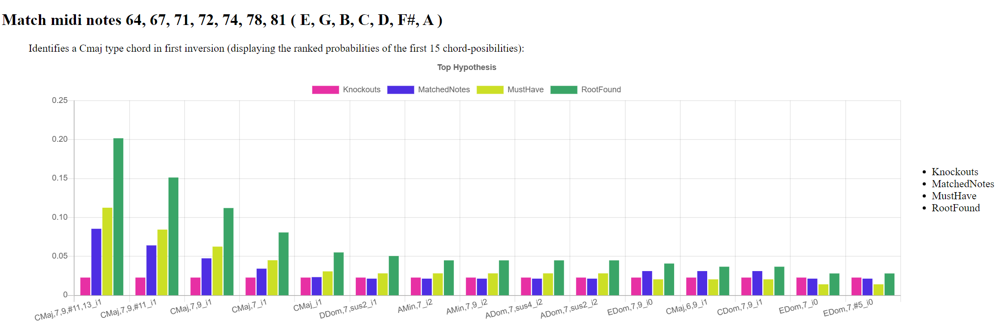

# CxChord
## Midi chord recognizer ##

Recognizes Chords from an array of midi notes and uses a Bayes probalistic method to find the most likely matches.

[An explaination of Midi Note Numbers can be seen here.](https://computermusicresource.com/midikeys.html)

Installation
-------------

    $ npm install cxchord

Usage JavaScript (sample.js):
----------------

Go into the example directory:
```
cd examples
```

```javascript
//
// Lookup Chords for midi notes
// 
var CxChord = require('../lib/CxChord');

console.log("-------------------");
var midiChord = [64, 67, 71, 72, 74, 78, 81 ];
var cm =  new CxChord.ChordMatcher()
cm.match(midiChord)
var mached = cm.getMatch();
console.log( JSON.stringify(mached, null, " ") );

console.log("-------------------");
console.log("First match a normal Major Chord:");
var midiChord = [ 63, 67, 69, 74];
var cm =  new CxChord.ChordMatcher();
cm.match(midiChord);
mached = cm.getMatch();
console.log( JSON.stringify(mached, null, " ") );

console.log("-------------------");
console.log("Then the same notes, but this time favor a Jazz block chord interpretation:");
cm.favorJazz(true);
cm.match(midiChord);
mached = cm.getMatch();
console.log( JSON.stringify(mached, null, " ") );
```
Execute the script at the command prompt:
```javascript
$ node sample.js
```

Usage TypeScript (tsSample.ts):
----------------
```javascript
import * as CxChord from "../lib/CxChord"

console.log("-------------------");
var midiChord = [64, 67, 71, 72, 74, 78, 81 ];
var cm =  new CxChord.ChordMatcher()
cm.match(midiChord)
var mached = cm.getMatch();
console.log( JSON.stringify(mached, null, " ") )
```
Compile and execute the script at the command prompt:
```javascript
$ tsc tsSample.ts
$ node tsSample.js
```

Usage HTML (sample.html):
----------------
This `sample.html` file will generate the following web-page:



```javascript
<!doctype html>
<html>
  <head>
    <title>CxChord HTML Example</title>
    <meta http-equiv="content-type" content="text/html; image/svg; charset=utf-8 ;">
    <meta http-equiv="Content-Security-Policy" content="default-src 'self'; img-src 'self' blob: data:; script-src 'self' 'unsafe-inline'; style-src 'self' 'unsafe-inline'">
  </head>
  <body>
    <h2> Math midi notes 64, 67, 71, 72, 74, 78, 81  ( E, G, B, C, D, F#, A ) </h2>
    <blockquote>
        Identifies a Cmaj type chord in first inversion (here displaying the first 15 chord-posibilities ranked): 
        <table>
            <tr>
                <td >
                    <canvas id="visualization"  height="400"  width="1300" ></canvas>
                </td>
                <td>
                    <div id="legend"></div>
                </td>
             </tr>
         </table>
    </blockquote>
    <script type="text/javascript"  src="./sample.html.bundle.js"></script>
   </body>
</html>
```
Open the html file in your browser. Note that the `examples/sample.html.bundle.js` is a browseryfied and bablified version of `examples\sample.html.js` in order to work in the browser. Have a look at `BrowserifyBuild.js` to see how this works.

You can have a look at the test specification src/CxChordSpec.ts for more details.